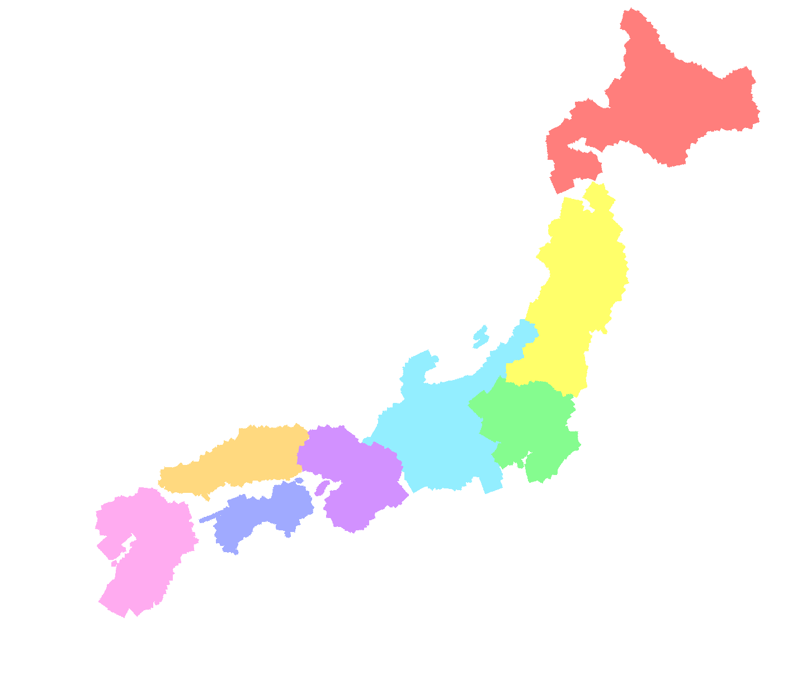

# MapKit

Provides some helpers to make area movement mechanism for Godot mono.

* Map scrolling
* Selected area highlighting & event.
* A reference data backend using `https://github.com/yiyuezhuo/province-pixel-map-preprocessor`.

## Requirements 

* `YYZLib`(https://github.com/yiyuezhuo/YYZLib). Add it to addons as well.
* `CsvHelper`, `MathNet.Numerics`, `Newtonsoft.Json`

Add following content to `*.csproj`

```xml
  <ItemGroup>
    <PackageReference Include="CsvHelper" Version="27.2.1" />
    <PackageReference Include="MathNet.Numerics" Version="5.0.0-alpha08" />
    <PackageReference Include="Newtonsoft.Json" Version="11.0.2" />
  </ItemGroup>
```

For example:

```xml
<Project Sdk="Godot.NET.Sdk/3.3.0">
  <PropertyGroup>
    <TargetFramework>net472</TargetFramework>
    <RootNamespace>February26Incident</RootNamespace>
  </PropertyGroup>
  <ItemGroup>
    <PackageReference Include="CsvHelper" Version="27.2.1" />
    <PackageReference Include="MathNet.Numerics" Version="5.0.0-alpha08" />
    <PackageReference Include="Newtonsoft.Json" Version="11.0.2" />
  </ItemGroup>
</Project>
```

## Usage

The addons provide a sample to show the usage, concretely.

### Prepare resources

* Create a [paradox style](https://eu4.paradoxwikis.com/Map_modding) pixel color province map `base_map`:
<a href="Sample/sample_map.png"></a>
* Use [pixel-map-preprocessor](https://github.com/yiyuezhuo/province-pixel-map-preprocessor) to create [remap](Sample/sample_map_remap.png) and related [json data](Sample/sample_map_data.json): `go run preprocess.go your_image_path`.
* Create a `mapData.tres` resource, set the script to `addons/MapKit/Scripts/MapData.cs`, set `Base Texture` to the `base_map`, and set `Region Data Path` to generated json.
* Create a `uiStateData.tres` resource, set Script to `addons/MapKit/Scripts/UIStateData.cs`.
* Create a `map_material.tres` of ShaderMaterial and set shader to `addons/MapKit/Shaders/map2.gds`, set `Base Texture` to `base_map`, and set `Remap Texture` to generated remap texture in "Shader Param".
* Create a new scene and instance `addons/MapKit/Sample/SampleMapView.tscn`, set `Ui State Data Res` of MapView node (root node) to `uiStateData.tres`. In Map node, set `Map Data Resource` to `mapData.tres`, texture to `base_map`, material to `map_material.tres`.
* Try to play the scene.
